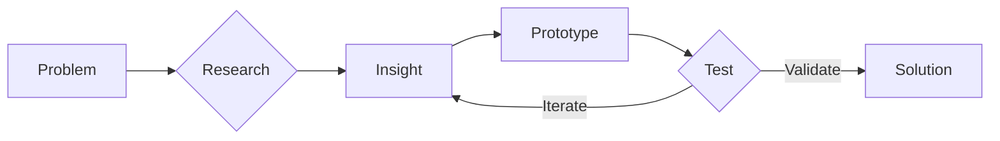

# AI Model Decision Matrix

> Guidelines for selecting appropriate AI models and methods for Health Design Sprint workflows.
> For use by Claude Code and course instructors.

## Quick Decision Tree

```
Need to generate an image/visual?
│
├─ Is it simple/geometric (icons, badges, diagrams)?
│   └─ YES → Use SVG code generation or Mermaid (FREE)
│
├─ Is it a flowchart, process diagram, or architecture?
│   └─ YES → Use Mermaid (FREE, editable, version-controlled)
│
├─ Is it UI mockup or wireframe?
│   └─ YES → Use HTML/CSS render to PNG (FREE)
│
├─ Is it complex, artistic, or synthesizing multiple concepts?
│   └─ YES → Use AI image generation (see model selection below)
│
└─ Is it a photograph or requires photorealism?
    └─ YES → Use AI image generation or stock photos
```

## Model Selection by Task

### Text Generation & Code

| Task | Model | Rationale |
|------|-------|-----------|
| Code generation | Claude (via Claude Code) | Primary workflow, best code quality |
| Document drafting | Claude | Strong writing, context retention |
| Data analysis | Claude | Reasoning, structured output |
| Quick Q&A | Claude | Already in context |

### Image Generation

| Task | Method | Cost | Speed | Quality |
|------|--------|------|-------|---------|
| Icons, badges | SVG code gen | Free | Fast | Excellent for simple shapes |
| Flowcharts | Mermaid | Free | Fast | Excellent, editable |
| Lower thirds, slides | HTML→PNG | Free | Fast | Pixel-perfect, brand-consistent |
| Session hero images | Gemini 3 Pro Image | ~$0.02/image | 10-30s | High |
| Complex infographics | Gemini 3 Pro Image | ~$0.02/image | 10-30s | High |
| Artistic/conceptual | Gemini 3 Pro Image | ~$0.02/image | 10-30s | High |
| Photo-realistic | DALL-E 3 (if needed) | ~$0.04/image | 15-45s | Highest for photos |

### Audio Generation

| Task | Method | Cost |
|------|--------|------|
| Background music | Pixabay (royalty-free) | Free |
| Custom branded audio | Suno AI | Free tier: 50 credits/day |
| Voice synthesis | Vapi (ElevenLabs backend) | Per-minute pricing |

## Standard Prompts by Workflow

### Session Hero Images
```
Create a hero image for [SESSION_NAME] in the Health Design Sprint course.
Theme: [THEME]
Style: Modern, minimal, professional. Use MDP brand colors where appropriate:
- Near-black: #1a1a1a
- Off-white: #f5f5f5
- Teal accent: #00897B
Dimensions: 1920x1080
Mood: [energetic/contemplative/collaborative/technical]
Include visual metaphors for: [CONCEPTS]
```

### Daily Recap Infographics
```
Create a daily recap infographic for Day [N] of Health Design Sprint.
Key themes covered: [LIST]
Student achievements: [LIST]
Visual style: Clean, modern, data-visualization aesthetic
Include the MDP chevron motif (<>) as a subtle design element
Dimensions: 1080x1080 (square for social) or 1920x1080 (presentation)
```

### Mermaid Diagrams (Free Alternative)


### SVG Icon Generation
```
Generate an SVG icon for [PURPOSE].
Specifications:
- Viewbox: 0 0 144 144
- Style: Minimal, geometric
- Colors: #1a1a1a on #f5f5f5 background
- Line weight: 8px stroke or filled shapes
- Export as both .svg (source) and .png (144x144)
```

## Cost Management Rules

### Always Free (Prefer These)
- SVG generation via code
- Mermaid diagrams
- HTML/CSS renders
- Markdown formatting
- Code-based visualizations

### Budget-Conscious (Use Thoughtfully)
- Gemini image generation: ~$0.02/image
- Limit to 10-20 generated images per course run
- Batch similar requests when possible

### Ask Before Using
- Any request that would generate >5 images at once
- Video generation (not currently set up)
- Real-time API calls during live sessions

## Confirmation Triggers

Claude Code should **ask for confirmation** before:

1. **Generating >3 images** in a single session
2. **Using paid APIs** for tasks that could be done free
3. **Creating assets** that deviate from MDP brand guidelines
4. **Batch operations** affecting multiple files
5. **Any destructive operation** (delete, overwrite)

### Confirmation Prompt Template
```
I'm about to [ACTION] using [METHOD].
- Estimated cost: [COST or "Free"]
- Alternative approaches: [LIST]
- Recommended: [RECOMMENDATION]

Proceed with [METHOD]? Or prefer an alternative?
```

## Quality vs. Speed vs. Cost Tradeoffs

| Priority | Choose | Example Use Case |
|----------|--------|------------------|
| Speed + Free | SVG/Mermaid/HTML | Quick iterations, drafts |
| Quality + Budget | Gemini 3 Pro | Final assets, hero images |
| Maximum Quality | Multiple generations + selection | Key marketing materials |
| Real-time/Live | Pre-generated assets | During live teaching |

## Pre-Generation Strategy

For predictable needs, **generate assets in advance**:

### Before Course Starts
- [ ] All 14 session hero images
- [ ] Holding slides (starting soon, break, outro)
- [ ] Lower thirds for all presenters
- [ ] Stream Deck icons
- [ ] Common diagram templates

### During Course (Generate Fresh)
- Daily recap infographics (incorporate actual content)
- Student work showcases
- Ad-hoc explanatory diagrams

## Model Capabilities Reference

### Gemini 3 Pro Image
- **Strengths**: Fast, good at text in images, understands complex prompts
- **Weaknesses**: Occasional inconsistency, may need regeneration
- **Best for**: Infographics, conceptual illustrations, diagrams with text

### DALL-E 3 (If Needed)
- **Strengths**: Highest photorealism, consistent style
- **Weaknesses**: Slower, more expensive, sometimes over-literal
- **Best for**: Photo-realistic images, artistic compositions

### SVG Code Generation
- **Strengths**: Free, perfectly scalable, version-controlled, editable
- **Weaknesses**: Limited to geometric/simple shapes
- **Best for**: Icons, logos, simple diagrams, badges

### Mermaid
- **Strengths**: Free, text-based (version-controlled), auto-layout
- **Weaknesses**: Limited styling, predetermined chart types
- **Best for**: Flowcharts, sequence diagrams, architecture diagrams

---

## Changelog

| Date | Change |
|------|--------|
| 2025-01-26 | Initial version |
